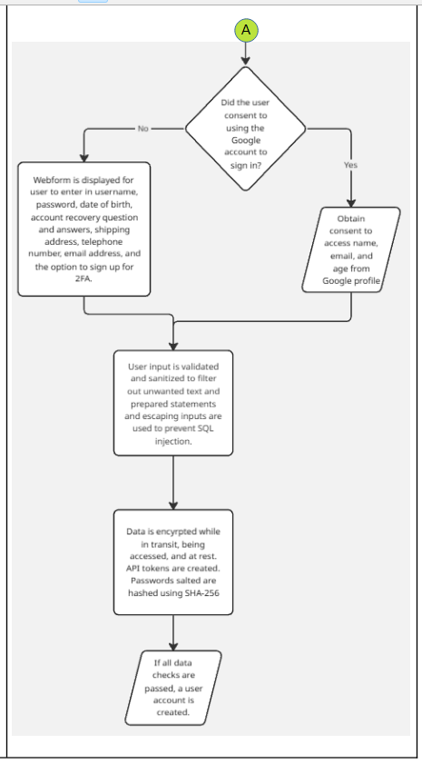

# PASTA-Threat-Modeling
This is a threat modeling worksheet using the PASTA method that was an assignment for part of the Coursera/Google Cybersecurity Certification that I'm pursuing.

## Table of Contents
* [General Info](#General-info)
* [Author](#Author)
* [Techologies](#Technologies)
* [Explaination](#Explaination)
* [Screenshots](#Screenshots)
* [Room for improvement](#Room-for-improvement)
* [Acknowledgements](#Ackknowledgements)
* [Release date](#Release-date)
* [Contact](#Contact)

## General Info
- This is a pretend threat modeling worksheet using the PASTA method created as part of my Coursera/Google Cybersecurity Certification.
- The premise is that a fictional e-commerce shoe exchange marketplace app is being developed, and this PASTA threat modeling exercise is used to help keep it secure. 

## Author
Jason Ash, Computer Science Major

## Technologies
- I'm currently pursuing an online Cybersecurity Certification through Coursera/Google. I answered the questions to this threat modeling worksheet in LibreOffice and saved it as a PDF, resulting in a format that is more WYSIWYG for viewers. It can be viewed in any Web browser that can view PDF files or in Adobe Acrobat Reader.
- I created the data flow diagram from scratch using Miro.com.

## Explaination
- The assignment template provided the writing prompts and questions in italics. My answers are below the italicized questions or after hollow bullet points.
- I created the data flow diagram from scratch using Miro.com and took screenshots of it to insert into the PASTA threat modeling worksheet.
- The attack tree is from the supporting materials provided by Coursera/Google.

## Screenshots

## Room for improvement
- As I learn more about cybersecurity, I could make my own attack tree and further improve my answers on this worksheet.
- I have a few minor typos in my data flow diagram elements.

## Release date
05 Jan 2026

## Acknowledgements
- As mentioned above, the writing prompts, questions in italics, and attack tree were provided by Coursera/Google as part of the assignment template.
- I created the data flow diagram from scratch using the tools on Miro.com.

## Contact
Jason Ash - wizardofki@gmail.com
